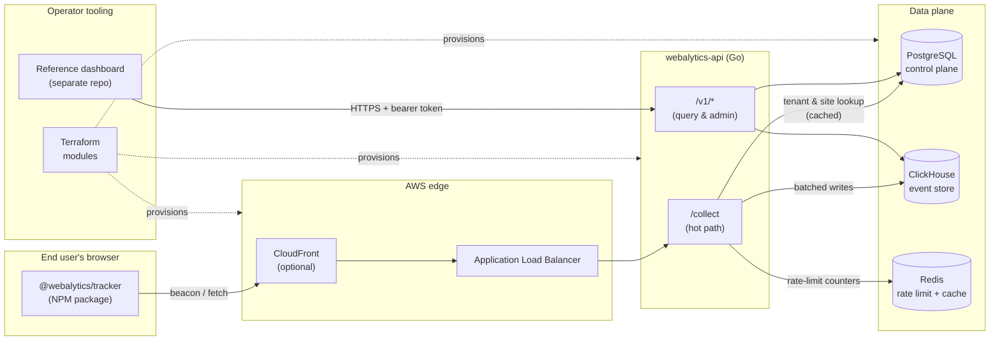
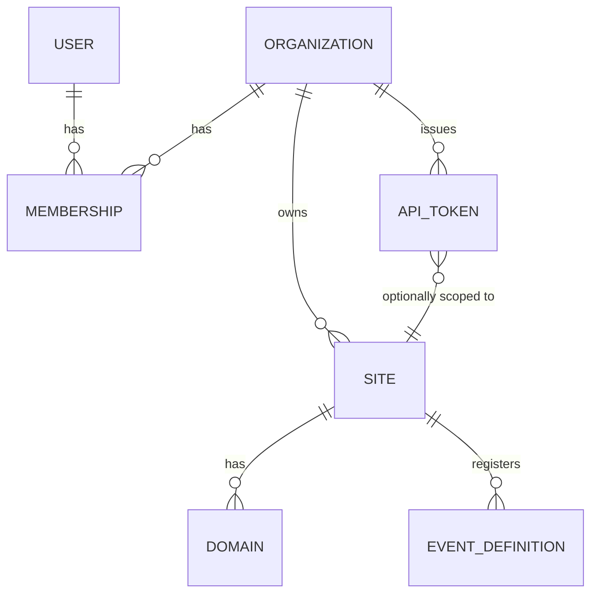
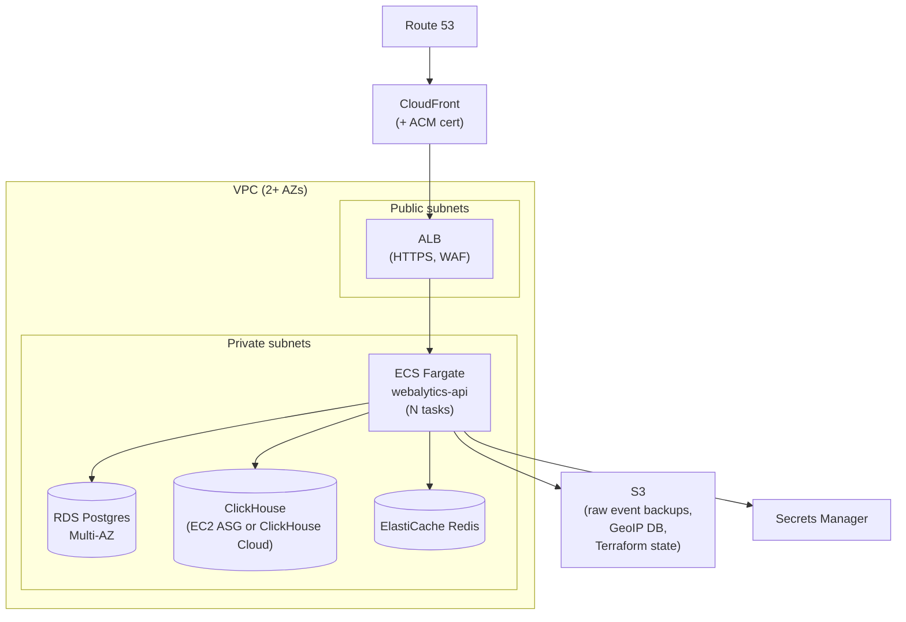

# Webalytics — Architecture

> A self-hosted, multi-tenant web analytics service. Go backend + NPM tracker +
> Terraform-deployable infrastructure. Inspired by Vercel Analytics, Plausible,
> and PostHog.

**Status:** Draft v0.2 — 2026-04-16
**Author:** Joshua Laviolette
**Audience:** Contributors, operators, and downstream integrators

### Changelog

- **v0.2 (2026-04-16)** — After reviewing Vercel Analytics screenshots:
  added `route` (normalized path) and `hostname` as first-class dimensions
  distinct from `url_path`; added `environment` and `release` as top-level
  tracker init fields and event columns; added real-time "online" endpoint;
  made Web Vitals (LCP, INP, CLS, FCP, TTFB) first-class in v1; modeled
  goals as a boolean flag on `event_definitions`; added period-over-period
  comparison as a standard response field on all stats endpoints.
- **v0.1 (2026-04-16)** — Initial draft.

---

## 1. Executive Summary

Webalytics is an analytics platform you host yourself. A tiny JavaScript
snippet (shipped as an NPM package) lives on a website, sends pageview and
event data to a Go ingest service, and the data lands in a database optimized
for analytical queries. A query API on the same service exposes aggregates so
downstream dashboards, ad-targeting jobs, and SEO tools can read from it.

The service is explicitly designed to be operated by the owner of the
websites it tracks. There is no hosted/shared tier. Every operator runs their
own stack, but the stack itself supports multiple tenants, multiple domains
per tenant, and multiple users per tenant, so it can comfortably be shared
within a team or agency.

### Primary goals

- Collect the core pageview signal: URL, referrer, approximate geo, device,
  UTM params, session continuity — with zero cookies and no consent banner
  required in most jurisdictions.
- Allow arbitrary named events (like GTM / Vercel custom events) registered
  from the client or server.
- Treat **domains** as a first-class dimension so a single tenant can compare
  performance across an entire SEO portfolio.
- Expose a well-documented query API so dashboards and ad-targeting
  pipelines can be built on top.
- Be stood up end-to-end with `terraform apply` against a fresh AWS account.

### Non-goals (for v1)

- Shipping a full dashboard UI. The product exposes an API; the reference UI
  is a thin example consumer, not the point of the project.
- Session replay, heatmaps, funnels as a native product. Events + a good
  query API give you the raw material; visualization lives elsewhere.
- Ad-targeting delivery. We produce the audience data; the integration with
  ad networks is a downstream concern.
- Being a drop-in Google Analytics replacement across every obscure feature.

---

## 2. System Overview



### Request lifecycle (hot path)

1. A browser loads a page that includes `@webalytics/tracker`.
2. The tracker reads its config (site ID, ingest URL) from a `<script>` tag
   or explicit `init()` call, collects the pageview fields it can gather
   without cookies or consent, and `POST`s a JSON body to `/collect`.
3. The Go service validates the request: is the site ID real, is the
   `Origin` / `Referer` on the domain allowlist for that site, are we under
   the per-site rate limit? Unknown or mismatched requests are dropped with
   a `204` so the tracker never alarms the page.
4. The service enriches the event server-side — turning IP into country /
   region / city via MaxMind, hashing the IP into a rotating daily session
   key, parsing the user agent — and appends the event to an in-memory
   batch.
5. Batches flush to ClickHouse every N ms or M rows, whichever is sooner.
6. The query API reads from ClickHouse for event data and from Postgres for
   tenant configuration, joining only at the edge.

---

## 3. Multi-tenancy Model

The product is designed so one deployment can cleanly host many logically
separated tenants without ever cross-contaminating data.

### Entities

- **Organization** — the billing/ownership unit. An operator running the
  service for themselves will typically have one; an agency will have one
  per client.
- **User** — a human who logs into the admin/query API. Belongs to one or
  more organizations through memberships.
- **Site** — a logical grouping of traffic. A site has:
  - a public `site_id` (e.g. `wb_live_7f2a...`) used by the tracker,
  - one or more **registered domains** (e.g. `example.com`, `blog.example.com`),
  - a timezone, a data retention policy, and feature flags.
- **API Token** — a bearer credential used against the query API. Scoped to
  an organization and optionally a specific site.

### Isolation strategy

All control-plane tables in Postgres carry `organization_id`. All event-plane
rows in ClickHouse carry `organization_id` and `site_id`. Every query
constructed by the service is built with a mandatory tenant predicate that
the handler layer is responsible for injecting; there is no query path that
reaches the database without a tenant filter.

Row-level security (RLS) is enabled in Postgres as a second line of defense,
so even a bug in a handler can't return another org's rows.

### Domain model



One tenant can register an arbitrary number of domains on a single site (for
SEO portfolios across ccTLDs, for example), or split them across sites if
they want separated retention / dashboards. Domain is always stored as a
dimension on every event so cross-domain rollups are free.

---

## 4. Data Model

Two data stores. The split mirrors the two access patterns: transactional
CRUD on a small amount of config data, and append-only analytical writes
over a very large number of events.

### 4.1 Postgres (control plane)

Postgres holds everything you'd put in a normal SaaS admin DB — tenants,
users, sites, tokens, dashboards, alert rules, saved queries, billing
metadata (if any).

```sql
-- organizations
CREATE TABLE organizations (
  id             UUID PRIMARY KEY DEFAULT gen_random_uuid(),
  slug           CITEXT UNIQUE NOT NULL,
  name           TEXT NOT NULL,
  created_at     TIMESTAMPTZ NOT NULL DEFAULT now(),
  deleted_at     TIMESTAMPTZ
);

CREATE TABLE users (
  id             UUID PRIMARY KEY DEFAULT gen_random_uuid(),
  email          CITEXT UNIQUE NOT NULL,
  password_hash  TEXT,           -- null when SSO-only
  created_at     TIMESTAMPTZ NOT NULL DEFAULT now()
);

CREATE TABLE memberships (
  organization_id UUID NOT NULL REFERENCES organizations(id) ON DELETE CASCADE,
  user_id         UUID NOT NULL REFERENCES users(id) ON DELETE CASCADE,
  role            TEXT NOT NULL CHECK (role IN ('owner','admin','analyst','viewer')),
  PRIMARY KEY (organization_id, user_id)
);

-- a "site" is a logical property; one site can span multiple domains.
CREATE TABLE sites (
  id              UUID PRIMARY KEY DEFAULT gen_random_uuid(),
  organization_id UUID NOT NULL REFERENCES organizations(id) ON DELETE CASCADE,
  public_site_id  TEXT UNIQUE NOT NULL,       -- 'wb_live_...', embedded in tracker
  name            TEXT NOT NULL,
  timezone        TEXT NOT NULL DEFAULT 'UTC',
  retention_days  INT  NOT NULL DEFAULT 365,
  settings        JSONB NOT NULL DEFAULT '{}',
  created_at      TIMESTAMPTZ NOT NULL DEFAULT now(),
  deleted_at      TIMESTAMPTZ
);
CREATE INDEX ON sites (organization_id);

CREATE TABLE domains (
  id              UUID PRIMARY KEY DEFAULT gen_random_uuid(),
  site_id         UUID NOT NULL REFERENCES sites(id) ON DELETE CASCADE,
  hostname        CITEXT NOT NULL,            -- 'www.example.com'
  is_primary      BOOLEAN NOT NULL DEFAULT FALSE,
  verified_at     TIMESTAMPTZ,
  created_at      TIMESTAMPTZ NOT NULL DEFAULT now(),
  UNIQUE (site_id, hostname)
);
CREATE INDEX ON domains (hostname);

-- explicit registration of custom events for validation and docs
CREATE TABLE event_definitions (
  id              UUID PRIMARY KEY DEFAULT gen_random_uuid(),
  site_id         UUID NOT NULL REFERENCES sites(id) ON DELETE CASCADE,
  name            TEXT NOT NULL,              -- 'signup', 'add_to_cart'
  description     TEXT,
  schema          JSONB,                      -- optional JSON schema for props
  is_goal         BOOLEAN NOT NULL DEFAULT FALSE,  -- counts toward conversion rate
  created_at      TIMESTAMPTZ NOT NULL DEFAULT now(),
  UNIQUE (site_id, name)
);

CREATE TABLE api_tokens (
  id              UUID PRIMARY KEY DEFAULT gen_random_uuid(),
  organization_id UUID NOT NULL REFERENCES organizations(id) ON DELETE CASCADE,
  site_id         UUID REFERENCES sites(id) ON DELETE CASCADE, -- optional scope
  name            TEXT NOT NULL,
  token_hash      BYTEA NOT NULL,
  scopes          TEXT[] NOT NULL DEFAULT '{read:events}',
  last_used_at    TIMESTAMPTZ,
  expires_at      TIMESTAMPTZ,
  created_at      TIMESTAMPTZ NOT NULL DEFAULT now(),
  revoked_at      TIMESTAMPTZ
);
```

RLS is enabled on the tenant-scoped tables (`sites`, `domains`,
`event_definitions`, `api_tokens`) with a policy that compares
`organization_id` to a session variable set by the handler.

### 4.2 ClickHouse (event plane)

ClickHouse is where every pageview and every custom event lives. One wide
denormalized table keeps queries fast; it's partitioned by month and sorted
for the queries we actually run.

```sql
CREATE TABLE events
(
    -- tenant keys (required on every row)
    organization_id  UUID,
    site_id          UUID,

    -- time
    ts               DateTime64(3, 'UTC'),
    date             Date MATERIALIZED toDate(ts),

    -- identity (none of this is PII)
    session_id       FixedString(16),    -- HMAC(ip, ua, daily_salt, site_id)
    visitor_id       FixedString(16),    -- HMAC(ip, ua, rolling_28d_salt)  optional
    is_new_session   UInt8,

    -- request
    event_name       LowCardinality(String),   -- 'pageview', 'web_vital', 'signup', ...
    hostname         LowCardinality(String),   -- 'www.example.com' (bare host)
    url_path         String,                   -- concrete path '/blog/hello-world'
    route            LowCardinality(String),   -- normalized '/blog/[slug]' (optional)
    url_query        String,
    referrer_host    LowCardinality(String),
    referrer_path    String,

    -- deployment
    environment      LowCardinality(String),   -- 'production' | 'preview' | 'dev' | custom
    release          LowCardinality(String),   -- e.g. git SHA or semver (optional)

    -- UTM
    utm_source       LowCardinality(String),
    utm_medium       LowCardinality(String),
    utm_campaign     LowCardinality(String),
    utm_term         String,
    utm_content      String,

    -- device
    ua_browser       LowCardinality(String),
    ua_browser_ver   LowCardinality(String),
    ua_os            LowCardinality(String),
    ua_device_type   LowCardinality(String),   -- 'desktop'|'mobile'|'tablet'|'bot'

    -- geo (from IP, never stored raw)
    country_code     LowCardinality(FixedString(2)),
    region           LowCardinality(String),
    city             LowCardinality(String),

    -- page metadata
    page_title       String,
    screen_w         UInt16,
    screen_h         UInt16,
    viewport_w       UInt16,
    viewport_h       UInt16,
    language         LowCardinality(String),

    -- custom event properties (schemaless)
    props            Map(String, String),
    revenue          Nullable(Decimal(18, 4)),
    revenue_currency LowCardinality(String),

    -- Web Vitals (only populated when event_name = 'web_vital')
    -- One row per vital reported, so LCP / INP / CLS etc. are separate rows.
    metric_name      LowCardinality(String),   -- 'LCP' | 'INP' | 'CLS' | 'FCP' | 'TTFB'
    metric_value     Nullable(Float64),        -- ms for timing, unitless for CLS
    metric_rating    LowCardinality(String),   -- 'good' | 'needs-improvement' | 'poor'

    -- derived / perf (for pageview rows)
    load_time_ms     Nullable(UInt32),
    ttfb_ms          Nullable(UInt32)
)
ENGINE = MergeTree
PARTITION BY toYYYYMM(ts)
ORDER BY (organization_id, site_id, event_name, hostname, ts)
TTL date + INTERVAL 400 DAY;         -- overridden per-site by mutation / projection
```

Materialized views maintain pre-aggregated rollups (daily unique visitors by
country, top pages per day, referrer breakdowns) so the dashboard doesn't
have to scan raw events for common questions. Retention is enforced by
per-site TTL, adjustable from the control plane.

A separate `sessions` materialized view, keyed on `session_id`, collapses
the event stream into per-session summaries for funnel and bounce
calculations.

### 4.3 Why this split

Postgres gives us transactional integrity for things like billing, team
membership, and token issuance, plus an ecosystem of tools (migrations,
RLS, auditing) we don't want to reinvent. ClickHouse gives us cheap, fast
analytical reads over billions of rows, which Postgres cannot do at
comparable cost. Keeping them separate means each store is used for what
it's great at, and — importantly — you can scale or restore them
independently.

---

## 5. Privacy, Legal, and Geo-Location

Advertising-adjacent analytics is a legally sensitive area. The design
treats compliance as a first-class requirement, not a last-step bolt-on.

### Posture

- **No cookies, no localStorage** by default for visitor identification.
  Sessions are derived from a server-side HMAC over `(IP, user agent,
  daily salt, site_id)`. The salt rotates every 24h UTC so the value is
  useless for cross-day tracking. This is the same pattern Plausible and
  Fathom use to stay out of the ePrivacy cookie-banner regime.
- **IP addresses are never persisted.** They are used only at request time
  for geo lookup and session hashing, then dropped before the row is
  written.
- **Geo resolution runs server-side** using a local MaxMind GeoLite2 or
  GeoIP2 database. We store country, region, and city; latitude/longitude
  are not stored.
- **Do Not Track** and **Global Privacy Control** headers are honored by
  default. Per-site overrides exist for operators with a different legal
  basis.
- **Data subject requests.** Because identifiers are daily-rotating hashes
  of an IP we never store, we cannot actually identify a user after the
  fact. This is a feature, not a gap: it puts the system in a GDPR-friendly
  pseudonymous-or-anonymous posture by default.
- **Bot filtering** happens at ingest using a maintained UA blocklist plus
  heuristic checks (e.g. missing language, implausible viewport). Bots are
  dropped before write.

### Ad-targeting caveat

The user goal includes "help advertising targeting." The audiences we can
legally produce are **aggregate segments keyed on things like country,
referrer, UTM, device type, and site-registered events** — not individual
profiles. The system intentionally makes it hard to reconstruct a person;
it makes it easy to say "the cohort of visitors who came from
`utm_source=reddit` on `example.com` and triggered `add_to_cart` in the
last 28 days totaled N users, distributed geographically like X." That is
usable as a lookalike or exclusion signal for ad platforms that accept
aggregates.

If an operator needs stable long-horizon visitor IDs for higher-resolution
targeting, they can opt a site into **consented mode**, which switches
identification to a first-party cookie after an explicit consent signal is
passed from the website. This is off by default.

---

## 6. Authentication & Authorization

Two different auth paths: one for the tracker (write), one for users and
integrators (read + admin).

### 6.1 Tracker → ingest

- The tracker embeds only a **public `site_id`**. This value is not a
  secret; assume it will be scraped.
- The ingest endpoint validates every request against the site's domain
  allowlist using the `Origin` header (preferred) or, failing that, the
  `Referer`. Requests from an unregistered host are silently rejected with
  a `204` so the tracker never logs or retries.
- A per-site rate limit on `/collect` (default 50 req/sec/IP, 500 req/sec
  total) lives in Redis. Exceedances are dropped, not errored, to avoid
  exposing throttling behavior to scrapers.
- For server-to-server ingestion (SSR frameworks, background jobs) the
  operator can mint a **write token** scoped to a single site. Write
  tokens bypass the domain check but are subject to the same rate limit.

### 6.2 Users & query API

- Users authenticate with email + password (argon2id) or OAuth/OIDC if the
  operator has configured a provider. Sessions are opaque tokens stored
  server-side with a short TTL and a refresh-on-use policy.
- Programmatic read access uses **API tokens** issued per organization
  (optionally scoped to a single site). Tokens are hashed at rest; the raw
  value is shown exactly once at creation.
- Authorization is role-based: `owner`, `admin`, `analyst`, `viewer`.
  Every handler resolves the caller's organization context and injects it
  into the query layer; downstream SQL builders refuse to execute without
  it.

---

## 7. API Surface

Two logical APIs on the same Go service, separated by path prefix and
middleware stack.

### 7.1 Ingest — `POST /collect`

Optimized for low latency, CORS-friendly, fire-and-forget from the browser.

Request body:

```json
{
  "site_id": "wb_live_7f2a...",
  "event": "pageview",
  "url": "https://www.example.com/blog/post-1?utm_source=reddit",
  "referrer": "https://www.reddit.com/r/golang/",
  "title": "Post 1 — Example",
  "screen": { "w": 2560, "h": 1440 },
  "viewport": { "w": 1280, "h": 800 },
  "language": "en-US",
  "props": { "plan": "pro" },        // optional; only for custom events
  "revenue": { "amount": 19.99, "currency": "USD" },  // optional
  "perf": { "ttfb_ms": 120, "load_ms": 430 },         // optional
  "ts_client": 1713270000123          // optional, clock-skew adjusted
}
```

Responses:

- `204 No Content` — accepted (default).
- `204` with `X-Webalytics-Debug: <reason>` when the caller has passed
  `?debug=1` (useful in dev).
- The endpoint never returns 4xx/5xx to a real browser under normal
  operation, to avoid noisy console errors on production websites.

A GET variant (`GET /collect?data=<base64-json>`) exists as a fallback for
environments where CORS preflight is problematic, and a `navigator.sendBeacon`
variant is preferred when the page is unloading.

### 7.2 Query API — `/v1/*`

Bearer-auth'd, JSON-in/JSON-out, versioned under `/v1`. Representative
endpoints:

| Method | Path                                          | Purpose                                               |
| ------ | --------------------------------------------- | ----------------------------------------------------- |
| GET    | `/v1/sites`                                   | List sites in the org                                 |
| POST   | `/v1/sites`                                   | Create a site                                         |
| POST   | `/v1/sites/{id}/domains`                      | Register a domain                                     |
| POST   | `/v1/sites/{id}/event-definitions`            | Register a named event                                |
| GET    | `/v1/sites/{id}/stats/summary`                | Top-line numbers + period-over-period deltas          |
| GET    | `/v1/sites/{id}/stats/timeseries`             | Any metric over time, any interval                    |
| GET    | `/v1/sites/{id}/stats/breakdown`              | Group-by on any dimension (page, referrer, country…)  |
| GET    | `/v1/sites/{id}/stats/funnel`                 | Ordered funnel over N event names                     |
| GET    | `/v1/sites/{id}/stats/retention`              | Cohort retention                                      |
| GET    | `/v1/sites/{id}/stats/web-vitals`             | p75/p95 distributions for LCP/INP/CLS/FCP/TTFB        |
| GET    | `/v1/sites/{id}/stats/realtime`               | Visitors online in the last 5 minutes                 |
| GET    | `/v1/sites/{id}/audiences/export`             | Aggregate cohort export (CSV) for ad-platform upload  |
| POST   | `/v1/tokens`                                  | Mint a new API token                                  |
| GET    | `/v1/export/events.ndjson?from=..&to=..`      | Raw event export (admin only)                         |

All `/stats/*` endpoints accept a common filter DSL (`hostname`, `path`,
`route`, `referrer_host`, `utm_*`, `country`, `device_type`, `browser`,
`os`, `environment`, `release`, `event`, `props.*`) so the same filters
compose across summary, timeseries, breakdown, and web-vitals views.

Every `/stats/*` endpoint also accepts an optional `compare` param
(`previous_period`, `previous_year`, or an explicit
`compare_from`/`compare_to` pair) and returns the comparison aggregates
alongside the primary window, so clients don't have to reconstruct
period-over-period deltas client-side.

### 7.3 Supported metrics

| Metric              | Definition                                                         |
| ------------------- | ------------------------------------------------------------------ |
| `visitors`          | Unique `session_id`s in the window                                 |
| `pageviews`         | `event_name = 'pageview'` count                                    |
| `sessions`          | Unique sessions; same as `visitors` in the default cookieless mode |
| `views_per_visitor` | `pageviews / visitors`                                             |
| `bounce_rate`       | `% of sessions with exactly 1 pageview`                            |
| `avg_session_s`     | Mean of `max(ts) - min(ts)` per session                            |
| `engaged_sessions`  | Sessions with ≥ 10s duration or ≥ 2 pageviews                      |
| `goal_completions`  | Count of events where the event definition has `is_goal = true`    |
| `conversion_rate`   | `goal_completions / sessions`                                      |
| `revenue`           | `SUM(revenue)`                                                     |
| `revenue_per_visitor` | `revenue / visitors`                                             |
| `lcp_p75` / `lcp_p95`, etc. | p75/p95 of the relevant Web Vital                          |

An OpenAPI 3.1 spec ships alongside the code in `/api/openapi.yaml` and is
the single source of truth for request/response shapes.

---

## 8. NPM Package — `@webalytics/tracker`

### Distribution

- Published as `@webalytics/tracker` (ESM + CJS + UMD builds).
- Ships with first-party adapters for Next.js, Remix, Astro, SvelteKit, and
  plain HTML. Each adapter wraps the core with framework-idiomatic hooks
  (e.g. `usePageview()`).
- Total gzipped size budget for the core: **< 2 KB**. No external deps.

### Public API

```ts
// core
init(config: {
  siteId: string;
  host: string;                  // the ingest URL, e.g. https://analytics.mycompany.com
  autoPageviews?: boolean;       // default: true
  autoWebVitals?: boolean;       // default: true — reports LCP/INP/CLS/FCP/TTFB
  autoOutbound?: boolean;        // default: false — tracks outbound clicks
  respectDNT?: boolean;          // default: true
  excludePaths?: (string | RegExp)[];
  environment?: string;          // default: 'production'
  release?: string;              // optional, e.g. git SHA
  route?: () => string | null;   // optional hook returning the normalized route
  debug?: boolean;
}): Tracker;

type Tracker = {
  pageview(url?: string): void;
  track(eventName: string, props?: Record<string, unknown>): void;
  identify(traits: Record<string, unknown>): void;  // consented mode only
  flush(): Promise<void>;
  setEnabled(enabled: boolean): void;
};
```

### Behavior

- **Auto pageviews.** On `init`, the tracker fires a pageview and attaches
  a History API listener for SPAs. Framework adapters hook into their own
  router events instead of the History API to avoid double-fires.
- **Batching.** `track()` calls are buffered briefly (default 250ms) and
  flushed together via `sendBeacon` on the `pagehide` event. On non-unload
  paths it uses `fetch` with `keepalive: true`.
- **Offline.** Events queued while offline are persisted to IndexedDB and
  replayed on next load, bounded to the last N minutes to avoid stale
  floods. Off by default; opt-in per site.
- **Failure mode.** The tracker never throws into application code.
  Network errors are swallowed and, in `debug: true`, logged to the
  console.
- **Script-tag install.** A drop-in `<script src="…/tracker.js"
  data-site-id="wb_live_…" data-host="…" defer>` is supported for users
  who don't want an NPM dep.

### Event registration

Two paths for custom events:

1. **Client-side ad-hoc**: `tracker.track('signup', { plan: 'pro' })`.
2. **Pre-registered** via the admin API or a config file committed to the
   site's repo. Registered events get validated against their JSON schema
   at ingest, appear in the dashboard's event picker, and participate in
   funnels without manual setup. Unregistered events are still accepted
   (for fast iteration) but flagged in the UI.

---

## 9. Infrastructure (AWS + Terraform)

The repo ships a root Terraform module that stands up a production-grade
deployment from scratch, plus a `docker-compose.yml` for local development.

### Topology



### Module layout

```
infra/
├── modules/
│   ├── network/            # VPC, subnets, NAT, SGs
│   ├── api/                # ECS service, task def, ALB target group
│   ├── postgres/           # RDS instance, param group, secret
│   ├── clickhouse/         # ASG + EBS, or ClickHouse Cloud provider
│   ├── redis/              # ElastiCache
│   ├── edge/               # CloudFront + ACM + Route53
│   └── observability/      # CloudWatch log groups, alarms, dashboards
└── envs/
    ├── dev/
    └── prod/
```

The root module in `envs/prod/main.tf` composes those building blocks into
a named environment. Operators typically only edit `envs/prod/terraform.tfvars`
(domain, instance sizes, retention) to get going.

### Local development

`docker-compose.yml` at the repo root brings up Postgres, ClickHouse,
Redis, and the Go service with live reload via `air`. A `Makefile`
wraps the common flows: `make up`, `make seed`, `make test`,
`make migrate`, `make openapi`.

### Deployment flow

1. `terraform apply` in `infra/envs/prod` provisions the stack.
2. CI builds the Go service, pushes an image to ECR, and runs
   `aws ecs update-service --force-new-deployment`.
3. Database migrations run as a one-shot Fargate task before the new
   service version is promoted (blue/green via ALB target groups).
4. GeoIP database is refreshed weekly by a scheduled Fargate task that
   drops the new `.mmdb` into S3; the service hot-reloads it.

---

## 10. Observability

- **Structured logs** (JSON) to stdout; picked up by CloudWatch Logs, with
  a tenant ID on every line.
- **Metrics** exposed on `/metrics` in Prometheus format: request rate,
  p50/p95/p99 latency per route, ingest accept vs drop counts (labeled by
  reason), ClickHouse batch size and flush latency, Postgres pool
  saturation.
- **Tracing** via OpenTelemetry; exporter is configurable (OTLP endpoint
  env var). Traces span the ingest → enrich → batch → flush path.
- **Alerts** (CloudWatch or the operator's preferred receiver):
  - `/collect` 5xx rate above 0.5% for 5 minutes.
  - ClickHouse insert failure rate above threshold.
  - Per-tenant ingest rate dropping to zero when it shouldn't.
  - Postgres replica lag.
- **Audit log** of admin actions (token creation, domain registration,
  user role changes) written to a dedicated Postgres table with append-only
  semantics.

---

## 11. Scaling & Capacity

Rough capacity targets for the v1 reference deployment (two `c7g.large`
Fargate tasks, one `db.r6g.large` Postgres, one `i3en.xlarge` ClickHouse):

- ≥ 2,000 `/collect` req/sec sustained, > 5k peak
- ≥ 10B events retained at 400-day TTL
- Query p95 < 500ms for standard dashboard queries over a 90-day window
- Horizontal scaling: the API is stateless, so the ingest tier scales with
  ECS desired count. ClickHouse scales by sharding on
  `organization_id`; the first shard is a single node.

---

## 12. Security Considerations

- All ingress is TLS 1.2+; CloudFront terminates and re-encrypts to ALB.
- WAF in front of the ALB with managed rules + a custom rule set that
  specifically blocks common header-spoofing tricks against `/collect`.
- Postgres and ClickHouse live in private subnets; no public endpoints.
- Secrets (DB passwords, JWT signing keys, GeoIP license) live in AWS
  Secrets Manager and are injected as env vars at task start.
- Token values are hashed with argon2id before storage.
- Dependency scanning (govulncheck, npm audit) runs in CI; failed scans
  break the build.
- Threat model doc lives at `docs/THREAT-MODEL.md` (to be written).

---

## 13. Implementation Roadmap

This doc is step 1 of the user's requested order: **architecture doc →
contracts → MVP**.

### Phase 0 — this document
- Agree on scope, stack, and boundaries.

### Phase 1 — Contracts
- `api/openapi.yaml` for the query API.
- JSON schema for the `/collect` payload.
- Postgres migrations (`migrations/*.sql`).
- ClickHouse DDL (`clickhouse/schema.sql`).
- TypeScript types for the NPM SDK generated from the JSON schema.

### Phase 2 — MVP backend (Go)
- Chi or stdlib `net/http` router, sqlc-generated Postgres code,
  `clickhouse-go` for events.
- Handlers: `/collect`, core `/v1` read endpoints, auth middleware.
- Batching writer, GeoIP enricher, UA parser.
- Docker image, `docker-compose.yml`, Makefile.

### Phase 3 — MVP NPM package
- Core tracker in TypeScript, ESM + CJS + UMD bundles with `tsup`.
- Next.js adapter as the first framework target.
- Snippet + install docs.

### Phase 4 — Terraform
- Modules listed in §9.
- `envs/dev` and `envs/prod` root modules.
- CI pipeline to build → push → migrate → deploy.

### Phase 5 — Hardening
- Rate limiting, bot detection tuning, WAF rules.
- Retention job, cold-storage export to S3 Parquet.
- OpenTelemetry traces, Prometheus scrape config, CloudWatch dashboards.

### Phase 6 — Reference dashboard (separate repo)
- Minimal Next.js app consuming the query API. Not part of this repo.

---

## 14. Open Questions

Things we should resolve before or during Phase 1.

1. **Visitor identity in consented mode.** If an operator opts in to
   cookies, do we want a first-party cookie or a cookieless first-party
   identifier stored in the page (e.g. via a server-injected hash)?
2. **ClickHouse hosting.** Self-managed ASG on EC2 (cheap, ops-heavy) or
   ClickHouse Cloud (pricier, zero-ops, but adds a vendor dependency)?
   Terraform should support both as a module choice.
3. **Billing/metering.** Out of scope for v1, but the schema should leave
   room for per-org event-count metering if we ever add a hosted tier.
4. **Export surface for ad-targeting.** Which ad platforms do we want
   turnkey exporters for (Google Ads Customer Match CSV, Meta Custom
   Audiences, LinkedIn, etc.)?
5. **Data residency.** Do any target users require EU-only processing? If
   so, the Terraform needs to support picking an EU region with no
   cross-region dependencies, and the GeoIP update path needs to stay
   inside that region.

---

## 15. Appendices

### A. Glossary

- **Ingest** — the `/collect` endpoint and its hot path.
- **Control plane** — Postgres and the APIs that mutate configuration.
- **Event plane** — ClickHouse and the query APIs that read from it.
- **Tenant** — shorthand for "organization" in most places in this doc.
- **Site** — a logical property owned by one org, spanning ≥ 1 domain.

### B. Comparable products

- **Plausible** — privacy-first, cookieless, ClickHouse-backed. Closest
  spiritual cousin. Open-source, self-hostable.
- **PostHog** — product analytics + session replay. ClickHouse-backed.
  Heavier/feature-richer; we're intentionally smaller.
- **Vercel Analytics / Web Vitals** — the original inspiration for the
  tracker UX. Closed source.
- **Fathom** — another cookieless alternative, closed source.

### C. Non-technical notes

- Naming: the repo is `webalytics`; the NPM package namespace is
  `@webalytics/*`; the public-facing product name is TBD but does not
  affect this design.
- License choice (AGPL vs MIT vs BSL) is deferred to the code-landing
  phase.
